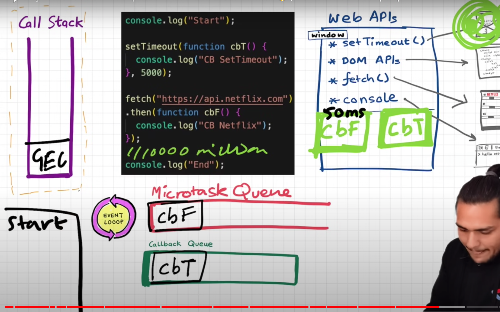

## Frontend Interview Question

### javascript

- let vs. const vs. var
- Currying, partial application
- How ‘this’ value is determined
- Callbacks, Promises, Async/Await
- Event Loop & Concurrency Model
- ES7, ES8, and beyond: JS’s new features
- JS Design Patterns: Writing efficient code
- Prototypes: Concept and relation to Objects
- DOM manipulation, event handling: Vanilla JS
- Array, string manipulation: Common techniques
- Arrow functions, Template literals, Destructuring
- Higher-order Functions in functional programming
- JS bundlers: Role in optimizing code for production
- Hoisting: Impact on variable and function declarations
- Throttling, Debouncing: Controlling function execution rate
- Unit testing: Popular frameworks like Jest or Mocha
- Web APIs: Importance and working with them in JS
- Data structures: Linked lists, stacks, queues in JS
- Caching, Memoization: Performance Techniques
- Security best practices: XSS, CSRF protection
- ES modules: Role in modern JS development
- Functional vs. Class Components in React
- == vs. ===: JavaScript value comparison
- Prototypal vs. Classical Inheritance
- Practical applications of Closures
- Error handling: try...catch blocks
- Scope chain, Lexical Scoping
- map, filter, reduce, forEach

### React
- Explain Flux.
- references in React
- synthetic events in React
- Real DOM vs Virtual DOM
- React router & advantages
- Redux different from Flux?
- How arrow function is used
- Why can’t browsers read JSX
- significance of Store in Redux
- concept of a Context in React
- server-side & client-side rendering
- handle asynchronous data loading
- concept of a Virtual DOM in React
- three principles that Redux follows
- Higher Order Components and usage
- major problems with MVC framework
- handle security in a React application
- React’s ES6 syntax vs compared to ES5
- handle optimization in a large application
- embed two or more components into one
- “In React, everything is a component.” Explain
- different phases of React component’s lifecycle
- track the unmounting of a functional component

### common 
- What is difference between sync and async 
- setTimeout and setInterval 
- What is unmount process on the react hook 
- How to optimise the react application,
- Higher order function and call function 
- Promise 
- Clouser 
- Let and var 
- Call and bind 
- Swallow copy and deep copy 
- Mongodb we can create collection in existing database 
- Agregation and what will do - mongodb 
- Git fetch and git pull - git
- What is rebase - git
- Use callback and useMemo 
- Higher order component 
- Use ref
- Node js even driven 
- Authentication code flow 
- What is type module are used in node js 
- Fs module 
- Redux code flow
- Grid and flex
- Postion absolute and fixed
- Redux saga
- And why are using redux saga and there code flow 
- What kind of hook are used 
- What kind of http request are used
- What is difference between put and patch 

> <strong> Explain Higher Order Component ?</strong>

*  A Higher Order Component (HOC) in React is a function that takes a component and returns a new component with enhanced features or behavior. 
* They enable you to encapsulate and extend the functionality of components in a modular and reusable way.

```javascript
// Higher Order Component (HOC) definition
function HOC(Comp) {
  // Returning a new component
  return function NewComp() {
    // Rendering the original component with a specific prop
    return <Comp name={'manya'} />;
  };
}

// Display Name component
const DisplayName = ({ name }) => {
  // Displaying the name prop in an h1 element
  return <h1>my name is: {name}</h1>;
}

// Applying the HOC to the DisplayName component
const ExtendCode = HOC(DisplayName);

// Main App component
export default function App() {
  return (
    <div className="App">
      {/* Rendering the component enhanced by the HOC */}
      <ExtendCode />
    </div>
  );
}

```

* In this example, we'll create an withAuthentication HOC that adds authentication logic to a component. This HOC will check whether the user is authenticated before rendering the wrapped component. If the user is authenticated, it will render the component; otherwise, it will redirect to a login page.
```javascript
import React, { useEffect, useState } from 'react';
import { Redirect } from 'react-router-dom';

// Simulated Authentication Service
const AuthService = {
  isAuthenticated: () => {
    // Simulate checking if the user is authenticated (you might replace this with your authentication logic)
    return localStorage.getItem('authenticated') === 'true';
  },
  login: () => {
    // Simulate a login action (you might replace this with your authentication logic)
    localStorage.setItem('authenticated', 'true');
  },
  logout: () => {
    // Simulate a logout action (you might replace this with your authentication logic)
    localStorage.removeItem('authenticated');
  }
};

// Higher Order Component (HOC) for Authentication
const withAuthentication = (WrappedComponent) => {
  return function WithAuthentication(props) {
    const [authenticated, setAuthenticated] = useState(false);

    useEffect(() => {
      // Check if the user is authenticated
      const checkAuthentication = () => {
        const isAuthenticated = AuthService.isAuthenticated();
        setAuthenticated(isAuthenticated);
      };

      checkAuthentication();
    }, []);

    return authenticated ? (
      // Render the wrapped component if authenticated
      <WrappedComponent {...props} />
    ) : (
      // Redirect to the login page if not authenticated
      <Redirect to="/login" />
    );
  };
};

// Example Component
const Dashboard = () => {
  return (
    <div>
      <h2>Welcome to the Dashboard!</h2>
      <button onClick={AuthService.logout}>Logout</button>
    </div>
  );
};

// Use the HOC to enhance the component
const AuthenticatedDashboard = withAuthentication(Dashboard);

// Render the enhanced component
const App = () => {
  return (
    <div>
      <h1>Real-world Example: Authentication HOC</h1>
      <AuthenticatedDashboard />
    </div>
  );
};

export default App;

```


> <strong> Custom Hook ?</strong>

```javascript
import { useEffect, useState } from 'react';

// Custom Hook: useLoading
const useLoading = () => {
  // State to manage loading status
  const [loading, setLoading] = useState(true);

  // useEffect to set loading to false after 3 seconds
  useEffect(() => {
    // Set a timeout to change loading to false after 3000 milliseconds (3 seconds)
    const timeoutId = setTimeout(() => {
      setLoading(false);
    }, 3000);

    // Cleanup function to clear the timeout if the component unmounts
    return () => clearTimeout(timeoutId);
  }, []); // Empty dependency array ensures the effect runs only once on mount

  // Return loading state and a function to manually set loading status
  return [loading, setLoading];
};

// Example usage in the App component
export default function App() {
  // Destructure the values returned by the useLoading hook
  const [loading, setLoading] = useLoading();

  return (
    <div className="App">
      <h1>{loading ? "Loading..." : "Hi everyone!"}</h1>
    </div>
  );
}
```

> <strong>Diff between HOC and custom hook ?</strong>
* HOCs: Use HOCs when you need to wrap components with additional props or behavior, especially if you have a mix of class and functional components or if you need to compose multiple enhancements.
* Custom Hooks: Use Custom Hooks when you want to extract and reuse stateful logic across multiple functional components. Custom Hooks are especially useful for managing side effects and complex logic.

> <strong>Why do we need currying in JS ? Explain with example. </strong>
* Currying is a functional programming concept that involves transforming a function with multiple arguments into a sequence of functions, each taking a single argument. The process of currying allows for the partial application of arguments, where a new function is created by providing some of the arguments to the original function. This results in more modular and composable functions, enhancing code flexibility and reusability.


* Imagine you have a list of products, and you want to filter them based on various criteria such as category, price range, and availability.

```javascript
// Sample list of products
const products = [
  { name: 'Product A', category: 'Electronics', price: 50, inStock: true },
  { name: 'Product B', category: 'Clothing', price: 30, inStock: false },
  { name: 'Product C', category: 'Electronics', price: 80, inStock: true },
  // ... more products
];

// Curried filter function
const filterProducts = (category) => (priceRange) => (availability) => (products) => {
  return products.filter(product => {
    const categoryCheck = category ? product.category === category : true;
    const priceCheck = priceRange ? product.price >= priceRange[0] && product.price <= priceRange[1] : true;
    const availabilityCheck = availability !== undefined ? product.inStock === availability : true;
    
    return categoryCheck && priceCheck && availabilityCheck;
  });
};

// Partial application to create specific filters
const filterElectronics = filterProducts('Electronics');
const filterExpensive = filterElectronics([60, Infinity]);
const filterInStock = filterExpensive(true);

// Apply the filters to the list of products
const filteredProducts = filterInStock(products);

console.log(filteredProducts);

```

> Explain closure ?
* A closure in JavaScript is a combination of a function and the lexical environment within which that function was declared. This allows a function to access variables from its outer (enclosing) scope even after that scope has finished executing. In simpler terms, a closure is formed when a function is defined inside another function, and the inner function has access to the outer function's variables.


* In this example, innerFunction is defined inside outerFunction. When outerFunction is called, it returns innerFunction. Even after outerFunction has finished executing, innerFunction still has access to the outerVariable. This is a closure.

```javascript
function outerFunction() {
  let outerVariable = 'I am from the outer function';

  function innerFunction() {
    console.log(outerVariable);
  }

  return innerFunction;
}

// Create a closure by calling outerFunction, which returns innerFunction
const closure = outerFunction();

// Execute the closure, which still has access to outerVariable
closure(); // Output: I am from the outer function

```

* In this example, createCounter is a function that returns another function. Each time createCounter is called, it creates a new closure with its own count variable. This allows you to create multiple independent counters, each with its own state.

```javascript
function createCounter() {
  let count = 0;

  return function() {
    count++;
    console.log(count);
  };
}

// Create two independent counters
const counter1 = createCounter();
const counter2 = createCounter();

counter1(); // Output: 1
counter1(); // Output: 2

counter2(); // Output: 1

```

> why we need closures ?
* Data Encapsulation/Privacy: Closures allow you to create private variables or state within a function. The variables declared in the outer function are not accessible from outside, but the inner function has access to them. This helps in encapsulating data and preventing it from being accessed or modified unintentionally.
* Maintaining State: Closures allow functions to "remember" the environment in which they were created. This is useful for maintaining state across multiple function calls without the need for global variables. Each closure maintains its own set of variables.

> disadvantage of closure ?
* over consumption of memory
* excessive or improperly used closures can impact performance.
* This can lead to memory leaks if developers are not careful about cleaning up unused closures.

> what is hoisting?
* It is phenomena by which u can access variable and function even before u have initialzed it.
However, it's important to note that only the declarations are hoisted, not the initializations

explaination -
* Whenever a JS program is run, a global execution block is created, which comprises of 2: Memory creation and Code execution.
* Variable declarations are scanned and are made undefined
* Function declarations are scanned and are made available
* Arrow functions enact as variables and get "undefined" during the memory creation phase while functions actually get run.


> Execution context?
* At first a global execution context is created, which consists of Memory and code and has 2 phases: Memory allocation phase and code execution phase.
* In the first phase, the variables are assigned "undefined" while functions have their own code.
* Whenever there is a function declaration in the code, a separate local execution context gets created having its own phases and is pushed into the call stack.
* Once the function ends, the EC is removed from the call stack.
* When the program ends, even the global EC is pulled out of the call stack.

> Define window object ?
* window object is created by the JS engines of the respective browsers when global execution context is created.
* whenever an execution context is created a "this" variable is also created.
* At the global level "this" points to the global object( window object in case of browsers).
* Anything that is not inside a function is the "global space".
* Whenever we create any variables or functions in the "global space", they get attached to the global object( window object in case of browsers).
* So to access the variables/function defined in the global space , 
	we can use any of the below:
	-	console.log(window.a);
	-	console.log(a);
	-	console.log(this.a)             //at the global space level, where this points to the window object

> Difference between not-defined and undefined ?
* Undefined is a Special Placeholder which is used to reserve memory for the variables in the memory creation phase. Even before a single line of code is executed JS engine assigns undefined to the variables.
* Not Defined means if we try to console or access any variable which is not declared in the code then we get Not Defined error.
* JS is a loosely typed language or weakly typed language means it does not attaches its variables to specific data types like in C++ and java.
* Remember undefined !== not defined.

> Explain lexical env, Scope & Scope chain?
* Lexical environment = EC's Local Memory + Reference to Lexical Environment of its parent.
* Lexical Environment of its parent is the scope where a function is physically present or defined. So, suppose a function x(), is defined and invoked in the GEC, when function x()'s EC is pushed in the call stack, it stores a reference to its parent's lexical environment i.e. the GEC's memory.
* Whenever a new Execution Context is pushed in the Call Stack it holds a reference to the Lexical Environment of its parent, i.e. the EC's memory from where it was invoked.
* Global execution context holds reference to null.
* Javascript engine first looks for the variable/function being accessed in the local scope of the function, and if not found, it keeps on searching the lexical environment of its parent until it finds the variable/function being accessed.
* The mechanism mentioned above is called SCOPE CHAIN.
* If the variable accessed is not found in the Scope Chain, then you will get the variable is not defined error in the  browser's console.

> let and const? their hoisting? Temporary Dead zone?
* Scoping
   - var is function-scoped, meaning the variable is visible throughout the entire function where it is declared.
   - If a var is declared within a block (like an if statement or loop), it is still visible outside of that block.
   - Both let and const are block-scoped, which means they are only accessible within the block (enclosed by {}) where they are defined.
* Hoisting
   - Variables declared with var are hoisted to the top of their scope during the compilation phase.
   - var declarations are initialized with undefined by default.
   - let and const declarations are not automatically initialized. If you try to use them before assignment, you get a ReferenceError.  
* let and const are hoisted but its memory is allocated at other place than window which cannot be accessed before initialisation.
* Thats phase from hoisting a variable till it assigns a value is called temporary dead zone.
```javascript

console.log(a) // it gives us an referenceError, becauze a is in temporary dead zone
console.log(b) // undefined - becauze b is in global memory space and given a special placeholder before assignment
let a = 10
var b = 20

```
* whenever we try to access variable in temporary dead zone
it gives us referenceError. 
* window.variable OR this.variable will not give value of variable defined using let or const.
* We cannot redeclare the same variable with let/const(even with using var the second time).
* const variable declaration and initialisation must be done on the same line.
* There are three types of error: [1] referenceError {given where variable does not have memory allocation} [2] typeError {given when we change type that is not supposed to be changed} [3] syntaxError {when proper syntax(way of writing a statement) is not used}.
* Use const wherever possible followed by let, Use var as little as possible(only if you have to). It helps avoid error.
* Initialising variables at the top is good idea, helps shrinks TDZ to zero.

> Block scope & shadowing?
* Code inside curly bracket is called block.
* Multiple statements are grouped inside a block so it can be written where JS expects single statements like in if, else, loop, function etc.
* Block values are stored inside separate memory than global. They are stored in block. (the reason let and const are called block scope)
```javascript
var a = 100
{
    var a = 10
    console.log(a); // 10
}
console.log(a); // 10

let a = 100
{
    let a = 10
    console.log(a); // 10
}
console.log(a); // 100


// Illegal shadowing
let a = 200;
{
 var a =20;
}

// As 'var' declaration goes to 'Global environment' and sets in Memory context, it cannot be set using 'Block environment' value 
// Hence: Uncaught SyntaxError: Identifier 'a' has already been declared
```
* Providing same name to the variable as of those variable which are present in outer scope is called shadowing.

> What is Function Expression ?
* When we assign a function into a variable that is Function Expression. & We can not do Hoisting by this becz it acts like variable.
```javascript
var a = function(){
           console.log("Function Expression");
      }
```

> Difference b/w Parameters and Arguments ?
* When we creating a function  & put some variabels in this ( ) that is our Parameters & When we call this function & pass a variable in this ( ) that is our Arguments

```javascript
function ab( param1, param2 ){} // param1 , param2 are parameters

ab(4, 5) // 4 & 5 are arguments
```

> What is First Class Function Or First class citizens?
* They are called first class citizens or first class functions because they have the ability to be stored in the variables, passed as parameters and arguments. They can also be returned in the function.

> what is callback function?
* Function that is passed on as argument to another function is called callback function.
* setTimeout helps turn JS which is single threaded and synchronous into asynchronous.

> Explain callback queue,call stack , micro-task queue, Starvation and Event Loop in details ?
* Call Stack : The call stack is a data structure that keeps track of the execution context of the program.
It stores function calls and executes them in a last-in, first-out (LIFO) manner.
* Event loop : The event loop is a continuous process and a mechanism through which the ‘calls waiting for execution’ in the callback queue/job queue can be put on the call stack.
For any event from the callback queue/job queue to come to call stack, the call stack will have to be empty.
* Microtask Queue: Microtasks are tasks with higher priority that need to be executed before the next macrotask.
Examples include promises (Promise.then(), async/await), mutation observer callbacks, and process.nextTick in Node.js.
* Callback Queue: The callback queue holds callback functions from asynchronous operations, such as setTimeout or event handlers.
When an asynchronous operation completes, its callback is added to the callback queue.
* Starvation: Microtask starvation occurs when the Microtask Queue is heavily populated with tasks, causing delays in the execution of other important tasks, particularly macrotasks. This can have implications for the overall responsiveness of the application.
* Execution Flow: Synchronous code is executed and added to the call stack.
When an asynchronous operation, like setTimeout, completes, its callback is placed in the Callback Queue or the Microtask Queue, depending on the type of task.
The event loop continually checks the Microtask Queue and Macrotask Queue for tasks.
If the Microtask Queue is not empty, all microtasks are executed before moving to macrotasks.
This ensures quick and high-priority execution of certain tasks.
If the Microtask Queue is empty, the event loop moves to the Macrotask Queue and executes the next macrotask.
The process repeats, with the event loop checking and executing tasks from the Microtask Queue and Macrotask Queue.
Microtasks have higher priority than macrotasks.
Excessive use of microtasks may delay the execution of macrotasks, potentially affecting application responsiveness.
 

* JS is single threaded. It has only one call stack.
* Execution of code in javascript is always line by line.
* Code in javascript is executed by JS Engine which uses the call stack to determine the order of execution.

* [event loop explaination url](https://www.scaler.com/topics/javascript/event-loop-in-javascript/)

> Js engine insides ?
* Parser: The parser reads the source code and converts it into an Abstract Syntax Tree (AST). The AST represents the grammatical structure of the code.
* Interpreter: The interpreter processes the AST generated by the parser and executes the code line by line. This is often referred to as "script interpretation."
* Compiler: Some JavaScript engines use a Just-In-Time (JIT) compiler. Instead of interpreting the code directly, the engine first compiles it into machine code for faster execution. This process occurs at runtime.
* optimizer: The optimizer analyzes the code and applies various optimizations to improve performance. It may inline functions, remove dead code, or make other adjustments.
* Garbage Collector: Memory management is handled by the garbage collector, which identifies and frees up memory that is no longer in use, preventing memory leaks. 
* Call Stack: The call stack keeps track of the execution context of the program. It's a stack data structure that stores function calls and their context.
* Heap: The heap is a region of memory where objects are allocated. It's managed by the garbage collector, which cleans up memory that is no longer needed.

Examples of JavaScript Engines:
* V8 (Used in Chrome and Node.js)
* SpiderMonkey (Used in Firefox)
* JavaScriptCore (Used in Safari):
* Chakra (Previously used in Microsoft Edge):

> Expain trust issue with setTimeout ?
* setTimeout of an ‘n’ seconds does not guarantee execution exactly when ‘n’ seconds have passed, rather it guarantees a minimum delay of ‘n’. This is because after a defined limit, the callback function moves to the callback queue (stating ready for execution) where the event loop is supposed to pick it for actual execution.
* The setTimeout function is executed only after call stack is empty, even if setTimeout is set to 0ms. 
* setTimeout ensures that minimum it will take the time mentioned because it may be paused due to call stack not empty.

> Higher order function ?
* A function which takes fn as an arguments or return a fn is called HOF
* fn which is passed to the HOF is callback function
* This is only possible because fn are first class citizens

> what is 'this' keyword?
* In JavaScript, the this keyword is a special keyword that refers to the current instance of an object or the context in which a function is executed. The value of this depends on how a function is called or how an object is accessed.

1. Global Context:
* In the global context (outside of any function or object), this refers to the global object, which is window in a browser or global in Node.js.
```javascript
console.log(this); // refers to the global object (e.g., window in a browser)

```
2. Function Context:
* When used in a regular function (not an arrow function), this refers to the object that called the function. If the function is not called as a method of an object, this might refer to the global object.
```javascript
function exampleFunction() {
  console.log(this);
}

exampleFunction(); // refers to the global object (e.g., window in a browser)

```
3. Method Context:
* When a function is a method of an object, this refers to the object that owns the method.
```javascript
const obj = {
  method: function() {
    console.log(this);
  }
};

obj.method(); // refers to the 'obj' object

```

4. Constructor Context:
* Inside a constructor function (used with the new keyword to create objects), this refers to the newly created instance.
```javascript
function Example() {
  this.property = 'value';
}

const instance = new Example();
console.log(instance.property); // 'value'
```

5. Event Handlers:
* In event handlers, such as those used in the DOM, this often refers to the element that triggered the event.
```javascript
<button onclick="console.log(this)">Click me</button>
```

6. Arrow Functions:
* Arrow functions do not have their own this context; instead, they inherit the 'this' value from the enclosing lexical scope.

> Diff between regular function and arrow fn ?
* 'this' Binding:
   
   - regular fn has it own this context, dynamically bound at runtime based on how the function is invoked.
   - The value of this can change depending on the calling context.
   - arrow fn inherits this from the enclosing lexical scope.

* 'new' keyword:   

   - regular fn can be used as a constructor function with the new keyword to create instances.
   - arrow fn cannot be used as a constructor; using new with an arrow function will result in an error.

* Arguments Object:

   - reg fn has access to the arguments object, which is an array-like object containing all the arguments passed to the function.
   - arrow fn does not have its own arguments object. If you need to access arguments, you can use the rest parameters syntax (...args).

* 'prototype' property:
 
   - Regular fn has a prototype property that can be used for prototype-based inheritance.
   - Arrow fn does not have its own prototype property. It cannot be used as a constructor, so it doesn't create objects with a prototype.

```javascript
// Constructor function
function Person(name) {
  this.name = name;
}

// Adding a method to the prototype
Person.prototype.sayHello = function() {
  console.log(`Hello, my name is ${this.name}`);
};

// Creating an instance
const person1 = new Person('Alice');

// Accessing the method from the prototype
person1.sayHello(); // Output: Hello, my name is Alice
```   

> what is prototype in js?
* Every function in JavaScript has a special property called prototype.
* This prototype property is initially an empty object.
* When you use a function as a constructor with the new keyword, the object created inherits properties and methods from the constructor's prototype.
* This allows you to define methods that are shared among all instances created with that constructor.

```javascript
// Constructor function
function Vehicle(make, model) {
  this.make = make;
  this.model = model;
}

// Adding a method to the prototype
Vehicle.prototype.start = function() {
  console.log(`${this.make} ${this.model} is starting.`);
};

// Creating instances
const car1 = new Vehicle('Toyota', 'Camry');
const car2 = new Vehicle('Honda', 'Accord');

// Using the shared method from the prototype
car1.start(); // Output: Toyota Camry is starting.
car2.start(); // Output: Honda Accord is starting.

```

> Template literals ?
* Template literals are a feature in JavaScript that allows you to embed expressions inside string literals, making it easier to concatenate variables and create more readable and flexible strings. Template literals are created using backticks ( ) instead of single or double quotes.


> what is Js bundler ?
* A JavaScript bundler is a tool that combines and packages multiple JavaScript files (and potentially other assets like CSS, images, etc.) into a single, optimized file or a set of files.
The main purpose of a bundler is to improve the performance and efficiency of web applications by reducing the number of HTTP requests and optimizing the delivery of code to the browser.

1. File Dependency Resolution: Bundlers analyze the dependencies between different JavaScript files. They create a dependency graph, which represents the relationships between various modules or files in the project.

2. Code Transformation: Bundlers often apply transformations to the code during the bundling process. For example, they can use transpilers like Babel to convert modern JavaScript (ES6+ syntax) into an older version that is compatible with a wider range of browsers.

3. Tree Shaking: Tree shaking is a technique used by bundlers to remove dead (unused) code from the final bundle. It helps in keeping the bundle size small by excluding code that is not referenced or executed.

4. Code Splitting: Code splitting involves breaking the bundled code into smaller, more manageable chunks. This is particularly useful for large applications, as it allows for more efficient loading of only the necessary code when it's needed, improving initial page load times.

5. Minification:Bundlers often minify the code by removing unnecessary characters such as whitespace and comments, and by shortening variable and function names. This reduces the size of the final bundle, improving download and parsing times.

6. Asset Handling: In addition to JavaScript files, bundlers can handle other types of assets, such as CSS, images, and fonts. They may also optimize and bundle these assets for better performance.

7. Dynamic Imports: Modern bundlers support dynamic imports, allowing developers to load modules on-demand, improving the application's performance by loading only the required modules when necessary.

Popular JavaScript bundlers include:

* Webpack: A widely-used bundler with a powerful plugin system that supports code splitting, hot module replacement, and more.

* Parcel: A zero-config bundler that aims to be fast and easy to use, supporting various asset types out of the box.

* Rollup: Known for its focus on creating smaller bundles and optimizing for ES6 module syntax.

> what is babel ?
* Babel is a popular JavaScript compiler that allows developers to write code using the latest ECMAScript (ES) standards (such as ES6 or ES2015 and beyond) and then transform, or transpile, that code into an older version of JavaScript that is compatible with a broader range of browsers. This process is essential for ensuring that web applications can run on environments that may not support the latest JavaScript features.

> what is hot module replacement ?
* Hot Module Replacement (HMR) is a feature in some JavaScript bundlers, build tools, and frameworks that allows developers to apply code updates and see the results in real-time, without requiring a full page reload.

> Throttling and Debouncing ?
* Throttling and debouncing are techniques used in JavaScript to control the rate at which a particular function is executed, especially in scenarios where rapid or frequent execution can cause performance issues or unnecessary resource consumption.

* Throttling: It ensure that their is a specified time interval between same function call.
Throttling ensures a function is executed at a regular interval.
In throttling, if a function is called more frequently than the specified interval, some calls are ignored.

    * Function Execution: 

      * If the function is called, it will execute immediately.
      * If the function is called again within a specified time interval, the second call is ignored.
      * After the time interval has passed since the last function execution, the function can be called again.

    * Use Cases:

      * User interface interactions like scrolling and resizing events. 
      * Preventing a function from being called too frequently in response to some event.

```javascript
// Throttle function definition
function throttle(func, delay) {
  // Initialize variable to keep track of the last function execution timestamp
  let lastCallTime = 0;

  // Return a throttled version of the original function
  return function (...args) {
    // Get the current timestamp when the throttled function is invoked
    const currentTime = new Date().getTime();

    // Check if the time elapsed since the last function call is greater than or equal to the specified delay
    if (currentTime - lastCallTime >= delay) {
      // If true, execute the original function with the provided arguments
      func.apply(this, args);

      // Update the last call timestamp to the current time
      lastCallTime = currentTime;
    }
  };
}

// Example usage: Create a throttled function that logs "Function executed!" with a delay of 1000 milliseconds
const throttledFunction = throttle(() => {
  console.log("Function executed!");
}, 1000);

// Attach the throttled function as an event handler for the window's scroll event
window.addEventListener("scroll", throttledFunction);

```

* Debouncing: Debouncing is a technique that ensures that a function is not executed until a certain amount of time has passed since the last time it was invoked.
Debouncing delays the execution of a function until there's a pause in its invocation.
In debouncing, if a function is called frequently, it will only execute after a pause in the calls.

    * Function Execution:

       * If the function is called, it won't execute immediately.
       * If the function is called again within a specified time interval, the timer is reset.
       * After the time interval has passed without any further calls, the function is executed.

    * Use Cases:

       * Input field events (e.g., keyup, input) to delay API requests until the user has stopped typing.
       * Window resize events to delay the execution of a function until the user has finished resizing.

```javascript
// Debounce function definition
function debounce(func, delay) {
  // Initialize a variable to store the timeout ID
  let timeoutId;

  // Return a debounced version of the original function
  return function (...args) {
    // Clear the existing timeout to restart the countdown
    clearTimeout(timeoutId);

    // Set a new timeout for the specified delay
    timeoutId = setTimeout(() => {
      // Execute the original function with the provided arguments after the delay
      func.apply(this, args);
    }, delay);
  };
}

// Example usage: Create a debounced function that logs "Function executed!" with a delay of 1000 milliseconds
const debouncedFunction = debounce(() => {
  console.log("Function executed!");
}, 1000);

// Attach the debounced function as an event handler for the window's resize event
window.addEventListener("resize", debouncedFunction);

```
        
> Explain call, apply and bind ?
* In JavaScript, call, apply, and bind are methods that allow you to set the value of this and pass arguments to a function in different ways.

1. 'call' Method:
```javascript

// In this example, the call method is used to borrow the fullName method from person1 and execute it in the context of person2. This allows person2 to use a method defined on person1 without having the method explicitly defined on itself.


const person1 = {
  firstName: 'John',
  lastName: 'Doe',
  fullName: function () {
    return this.firstName + ' ' + this.lastName;
  },
};

const person2 = {
  firstName: 'Jane',
  lastName: 'Doe',
};

// Using call to borrow the fullName method from person1 for person2
const janeFullName = person1.fullName.call(person2);

console.log(janeFullName); // Output: Jane Doe

```

```javascript
// Here, the call method is employed to invoke the greet function with a specific this value (user). This allows the function to access the name property of the user object.

function greet(message) {
  console.log(`${message}, ${this.name}!`);
}

const user = {
  name: 'Alice',
};

// Using call to set the 'this' value for the greet function
greet.call(user, 'Hello');

// Output: Hello, Alice!

```

2. 'apply' Method
* Similar to call, the apply method is used to invoke a function with a specified this value, but it takes an array or an array-like object as the second argument, which represents the arguments to be passed to the function.

```javascript
// In this example, the apply method is utilized to invoke the fullName method of the person object with a specific this value (user). The second argument is an array ['Hello'], which is passed as the argument to the fullName function.

const person = {
  fullName: function (greeting) {
    return `${greeting}, ${this.firstName} ${this.lastName}`;
  },
};

const user = {
  firstName: 'John',
  lastName: 'Doe',
};

// Using apply to set the 'this' value for the fullName function
const greetingMessage = person.fullName.apply(user, ['Hello']);

console.log(greetingMessage); // Output: Hello, John Doe

```

```javascript
// Here, the apply method is employed to apply the sumValues function to the array values. The elements of the array are used as arguments for the function.

function sumValues(a, b, c) {
  return a + b + c;
}

const values = [2, 4, 6];

// Using apply to apply the sumValues function to an array of values
const result = sumValues.apply(null, values);

console.log(result); // Output: 12

```

3. 'bind' method
* bind allows you to set both the 'this' value and some initial arguments for a function, creating a new function with these fixed properties.

```javascript

// In this example, bind creates a new function greetBob based on the greet function. When greetBob is invoked, it acts as if it were greet with this set to null (global object) and the argument 'Bob' fixed.

function greet(name) {
  console.log(`Hello, ${name}!`);
}

// Using bind to create a new function with a specific context (this value)
const greetBob = greet.bind(null, 'Bob');

// Invoking the new function
greetBob(); // Output: Hello, Bob!

```

```javascript
// Here, bind is used to create a new function greetPerson based on the greet method of the person object. The new function, when invoked, has its 'this' value set to the person object, allowing it to access the name property.

const person = {
  name: 'Alice',
  greet: function () {
    console.log(`Hello, ${this.name}!`);
  },
};

// Using bind to create a new function with a specific context (this value)
const greetPerson = person.greet.bind(person);

// Invoking the new function
greetPerson(); // Output: Hello, Alice!

```